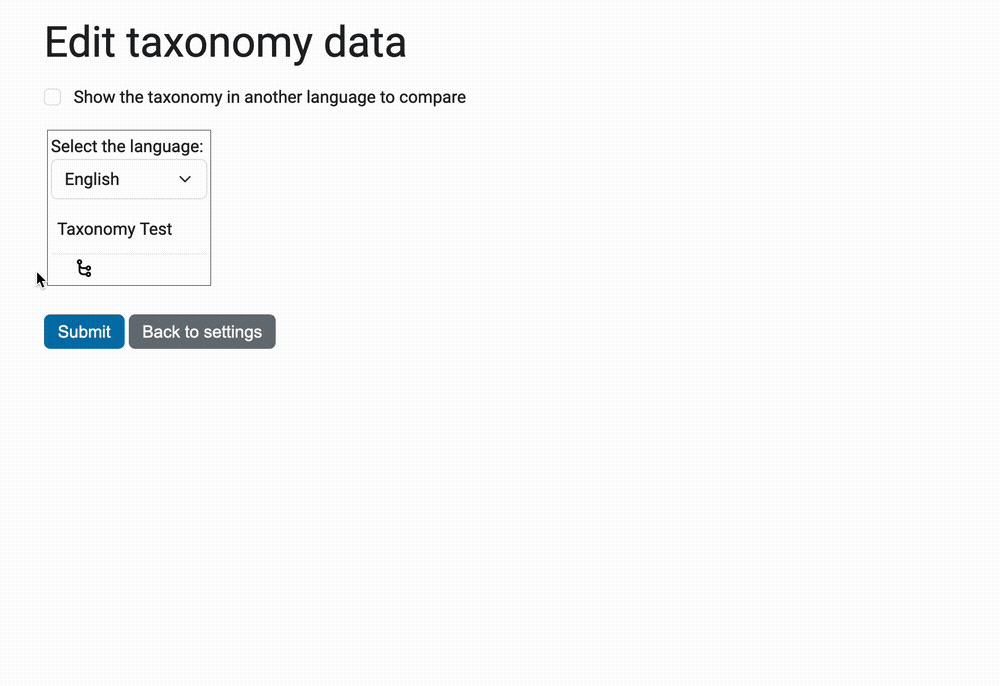

This add-on provides support for hierarchical taxonomies in multiple
languages, letting users easily associate existing content with terms
from one or more taxonomies.

    `Taxonomy <http://en.wikipedia.org/wiki/Taxonomy>`_ is the
    "discipline of defining groups [...] on the basis of shared
    characteristics and giving names to those groups. Each group is
    given a rank and groups of a given rank can be aggregated to form
    a super group of higher rank and thus create a hierarchical
    classification".

Here's an example of the "taxonomic kingdoms of life"::

    Living Organisms
    Living Organisms -> Eukaryotic
    Living Organisms -> Eukaryotic -> Simple multicells or unicells
    Living Organisms -> Eukaryotic -> Multicellular
    Living Organisms -> Eukaryotic -> Multicellular -> Autotrophic
    Living Organisms -> Eukaryotic -> Multicellular -> ...
    Living Organisms -> Prokaryotic
    Living Organisms -> Prokaryotic -> Archaebacteria
    Living Organisms -> Prokaryotic -> Eubacteria
    Living Organisms -> Prokaryotic -> Eubacteria -> ...

Taxonomies can be quite large, sometimes in the tens of thousands
(10,000+). And in sites with multiple languages, each title – or
*caption* – must appear in translation.

Note that the selection of a term in the hierarchy implies the
selection of all its parents. In the example above this means that if
"Eubacteria" is selected, then also "Prokaryotic" and "Living
Organisms" will be.


Overview
========

The implementation tries to meet the following requirements:

#. Support many (10,000+) terms.

#. Terms can be organized in a hierarchical classification.

#. Easily import and export in a common format (VDEX).

#. Taxonomies will provide vocabularies that are translateable.

#. Use behaviors to provide a choice field for each taxonomy.

#. Manage taxonomies and assign to content types "through-the-web".

In the description below, we touch on each of these requirements.


Data structure
--------------

In order to limit both the memory and computation requirements, the
term data is contained in exactly one persistent index per language, a
mapping from the *materialized term path* to its *term identifier*.

The term::

    Living Organisms -> Eukaryotic -> Simple multicells or unicells

will be indexed under this path::

    "Living Organisms/Eukaryotic/Simple multicells or unicells"

The index allows us to provide an iterator over the sorted vocabulary
terms, virtually without cost (as well as containment queries).

At the same time, while the hierarchy is encoded, we can quickly look
up terms in a subtree.

Note: As ``collective.taxonomy`` uses slash as separator, you have to monkey patch the ``PATH_SEPARATOR`` constant if you want to use '/' in your terms.


Data exchange
-------------

While ``collective.taxonomy`` (this package) does make it possible to
create, manage and edit taxonomies from a browser-based interface, the
primary focus is to support the exchange of terms in the VDEX format:

    The `IMS Vocabulary Definition Exchange
    <http://www.imsglobal.org/vdex/>`_ (VDEX) specification defines a
    grammar for the exchange of value lists of various classes:
    collections often denoted "vocabulary".

This exchange is integrated with `GenericSetup
<http://packages.python.org/Products.GenericSetup/>`_ which manages
imports and exports using setup profiles. It is also possible to
use the controlpanel for importing and exporting VDEX files.

The package comes with integration for the `Dexterity
<http://plone.org/products/dexterity/>`_ content type framework: for
each taxonomy, a *behavior* is available that adds a choice field
which pulls its vocabulary from the taxonomy. The behavior is
configurable in terms of field name, title and whether it allows the
selection of one or more multiple terms.  You should *first* install
dexterity and then ``collective.taxonomy``, otherwise the behaviors
for the existing taxonomies will be missing.


How does it work?
-----------------

The main objective during this project has been to get a high rate
of through-the-Web administration. Therefore the use of the product
will not require any Python programming nor configure.zcml directives.

In the controlpanel (``/@@taxonomy-settings``), the user can:

#. Import taxonomies from VDEX files.

#. Export taxonomies existing to VDEX files.

#. Delete taxonomies

#. Add and delete behaviours for taxonomies

When a new behavior is created for a taxonomy, it can easily be added
to the desired content types using the content type control panel, provided
by Dexterity. After this is done, the taxonomy is available on add and edit
forms, and it is also available for collections, if ``plone.app.collection``
is used on the site. An index is also created, so the taxonomies can easily
be used for catalog queries.

See a short guide on how to use the product `here <http://bo.geekworld.dk/introducing-collective-taxonomy/>`_.

Development
===========

React/Redux app to edit taxonomies
----------------------------------

The view ``@@taxonomy-edit-data`` that allow users to edit the taxonomy data is a React/Redux app (the source code is in the ``javascripts`` directory.

Here's a preview of this view:



The languages allowed for the taxonomies are the languages defined in ``portal_languages``.

Development
```````````

Run the app, run ``npm start`` in the ``javascripts`` directory.
To make Plone use the development code, you need the ``NODE_ENV`` environment variable to be set to ``development``:

::

    NODE_ENV=development bin/instance fg


i18n
````

The app uses `react-intl <https://github.com/yahoo/react-intl>`_ to handle i18n. To translate the app, add a new language in the translations directory. For example, create a ``es`` file in the translations directory that contains:

::

    const es = {
        submitLabel: 'Enviar',
    }

    export default es

Then, edit ``translations/index.js`` to add the language to the translations object:

::

    import es from './es'

    const translations = {
        es,
        fr
    }

You'll have to rebuild the js bundle: ``npm run build``

That's it!

Requirements
============

* Plone 4.3
* or an older version using a recent version of plone.dexterity/plone.app.dexterity

Frequently Asked Questions
==========================

How can I import an existing ``ATVocabularyManager`` vocabulary?

  Use the script provided in this `gist <https://gist.github.com/3826155>`_. Just
  remember to edit the vocabIdentifier and vocabName.

To-Do
=====

.. image:: https://secure.travis-ci.org/collective/collective.taxonomy.png?branch=master
    :alt: Travis CI badge
    :target: http://travis-ci.org/collective/collective.taxonomy

.. image:: https://coveralls.io/repos/collective/collective.taxonomy/badge.png?branch=master
    :alt: Coveralls badge
    :target: https://coveralls.io/r/collective/collective.taxonomy

- Better documentation.


Contributors
============

Author
------

- Bo Simonsen <bo@headnet.dk>


Contributors
------------

- Malthe Borch <mborch@gmail.com>

- Thomas Clement Mogensen <thomas@headnet.dk>

- Thomas Desvenain <thomas.desvenain@gmail.com>

- Maurits van Rees <maurits@vanrees.org>

- Cédric Messiant <cedric.messiant@gmail.com>


Existing work
=============

In 2010, Rok Garbas <rok@garbas.si> reimplemented and extended prior
work by `Seantis <http://www.seantis.ch/>`_ and released
`collective.vdexvocabulary
<http://pypi.python.org/pypi/collective.vdexvocabulary>`_. This
package allows you to configure and populate vocabulary components
from a VDEX-specification. The package supports flat vocabularies
only, and support for multiple languages takes a different approach
(vocabularies are returned in an already translated form). Note that
vocabularies are loaded in a read-only mode, although it's been
proposed that vocabularies might be edited through-the-web.

In 2005, Jens Klein <jens.klein@bluedynamics.com> released
`ATVocabularyManager
<http://plone.org/products/atvocabularymanager>`_. This package makes
it possible to create taxonomies using Plone's content management
interface with terms existing as regular site content. It's integrated
with the `Archetypes <http://plone.org/products/archetypes>`_ content
type framework (now deprecated).


.. [#] Term relationships are currently not supported.
