## Creating a Portfolio

Let's think we have a company website, and need to show a Portfolio.
At this Portfolio we wish to show a list of pages created by this company grouped by two levels of categories, field of the website in portfolio and country of location.
Let's take for example a company that makes websites for Museums, and others.
At the Portfolio page we wish to be able to filter by Field and location.

### Add taxonomy
To add taxonomy we go into the [control panel](http://localhost:8080/Plone/@@overview-controlpanel) and click in Taxonomies option:
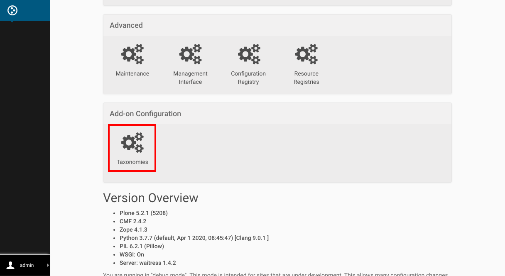

This is the place where you manage your Taxonomies, let's add a new Taxonomy:


Here we have many options related to the new category, let's fill the first 3 fields:
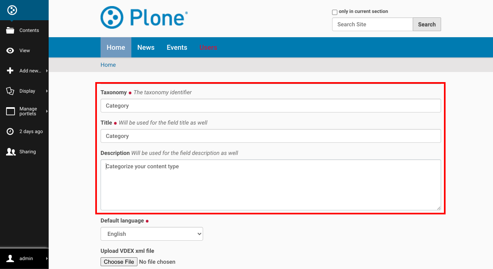

And hit the Add button:
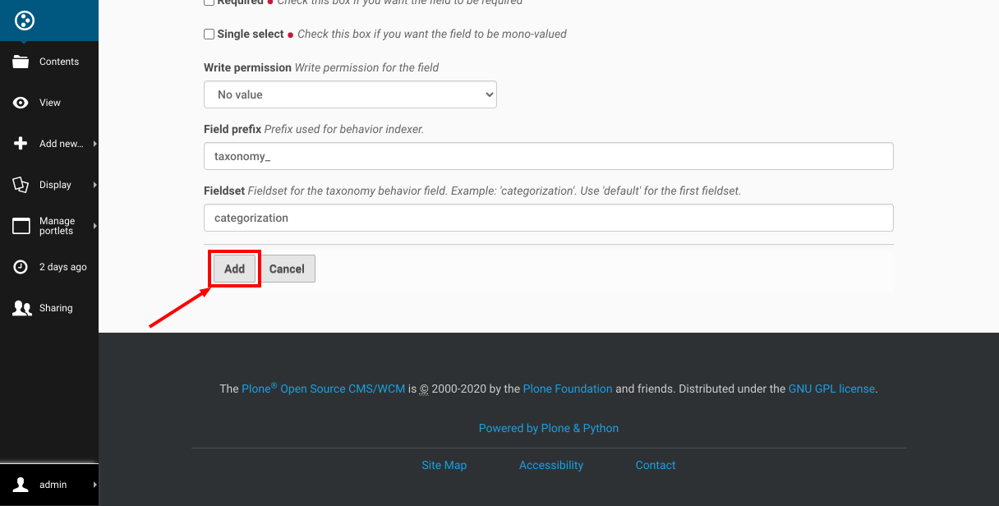

### Add taxonomy data
Now that we have our first Taxonomy created, let's add some data in it with the option "Edit taxonomy data":
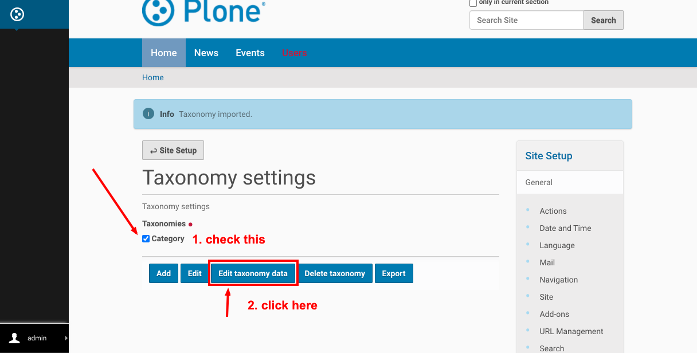

The editor allow you to edit a tree structure, what allow us to create a complex categorization, for our simple use case we will use just 2 levels, but you can use as much as needed:
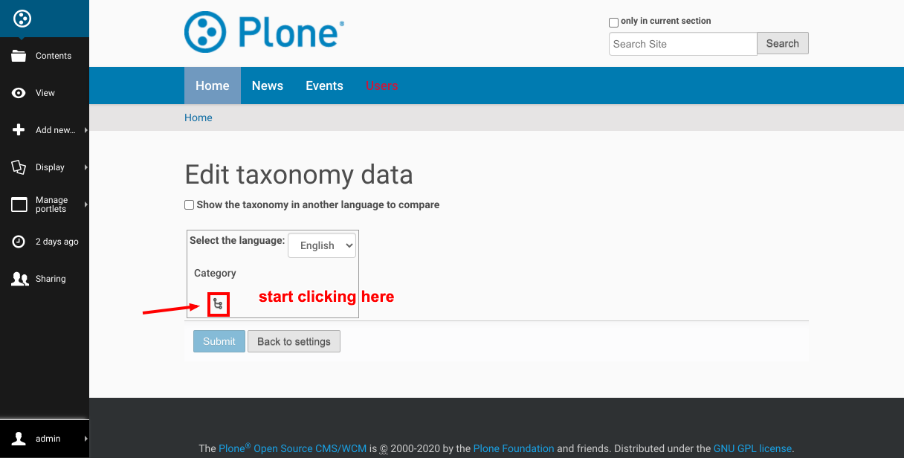
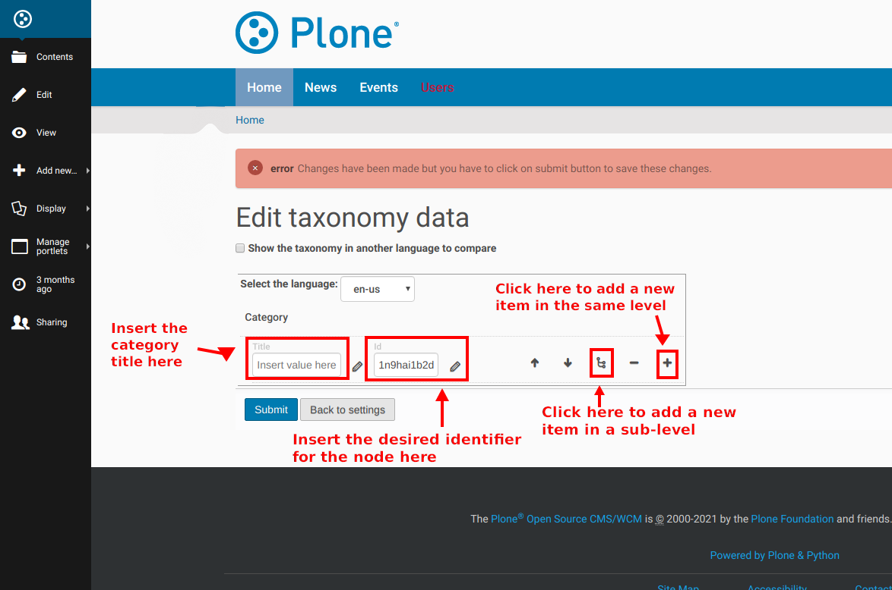

The Id (identifier) needs to be unique for each node, it is automatically generated when adding a new node.

This is the final result of our categories, hit "Submit" when you have the same.
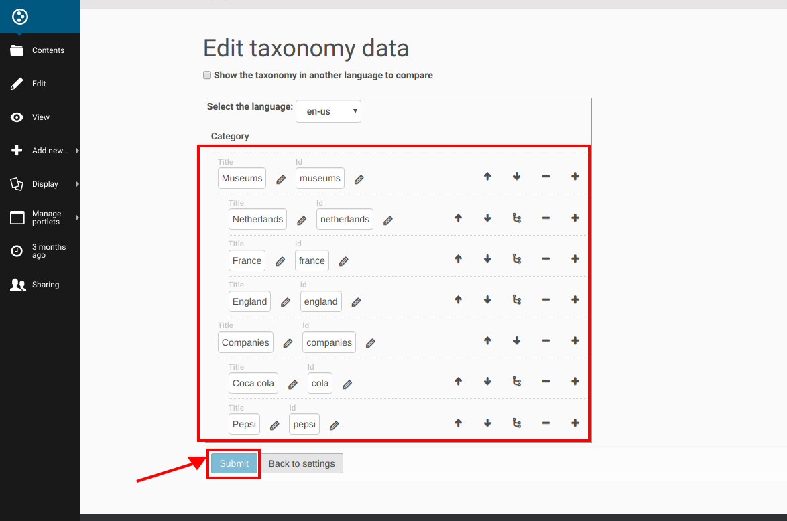

### Enable behavior
After this configuration we have a new field ready to be added to our content type, but we still need associate both.
To do this, let's go to the [Dexterity Content Types](http://localhost:8080/Plone/@@dexterity-types) configuration:
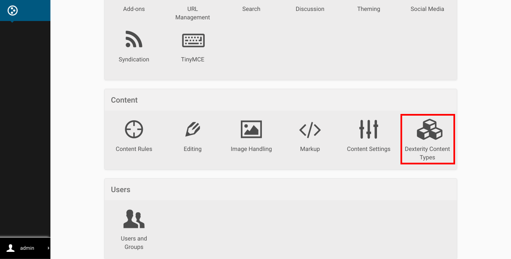

Open the content type we want to associate with our taxonomy (in this case "News Item"):
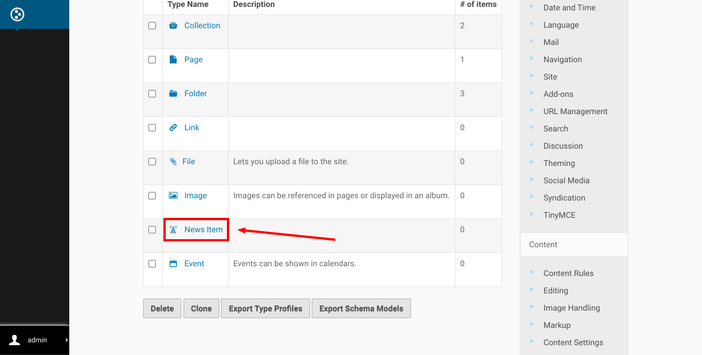

Click on the "Behaviors" tab:
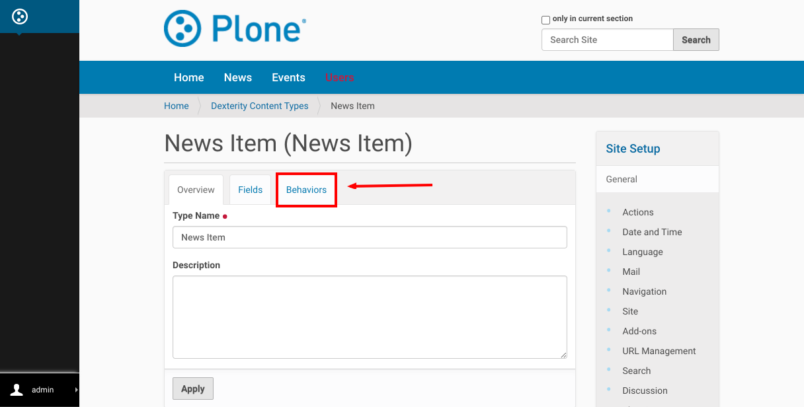

Select our taxonomy:


And hit "Save" button:
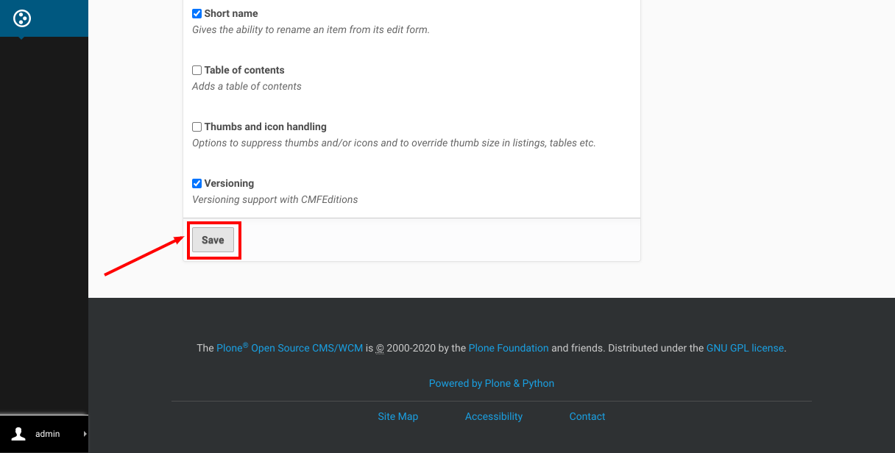

### Add categorized News items
Finally it is time to create our Portfolio!

Let's add a folder in the [root](http://localhost:8080/Plone):
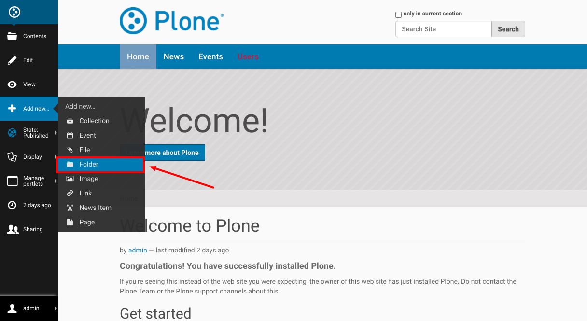

With name Portfolio:
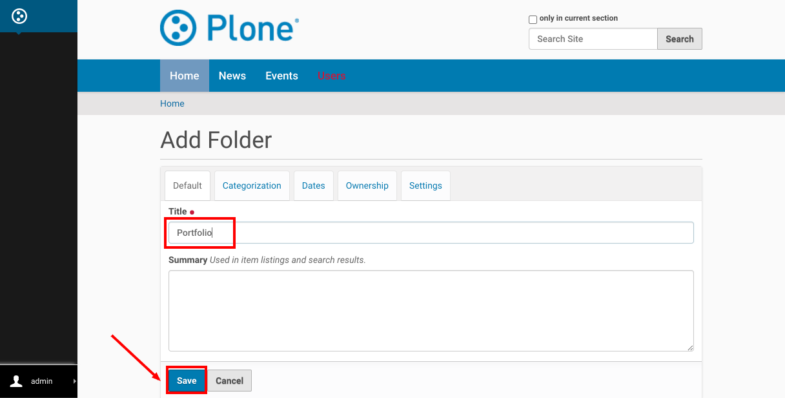

Don't forget to Publish:
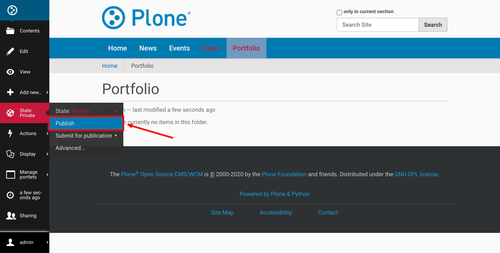

Than [inside this folder](http://localhost:8080/Plone/portfolio) let's add some "News items":
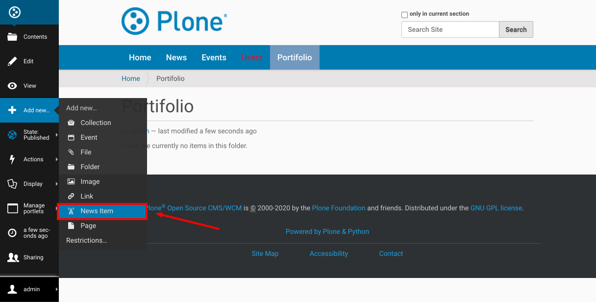

And our taxonomy is in the "Categorization" tab:


To add a Category, select the item and click on the "↓" button (note that you can add more than one category):
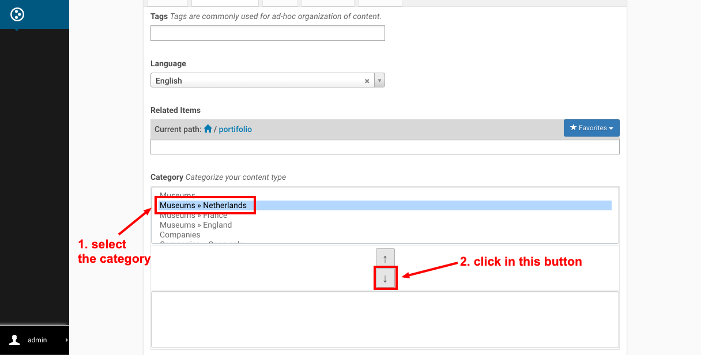

Add as many items as needed.

### Add a view to show the Portfolio
Now you can create a new view for Folder to show the Portfolio with the filters, following the [Plone documentation](https://docs.plone.org/external/plone.app.dexterity/docs/custom-views.html), we suggest to have this in your new view:

At your `browser.py` file, create the browser view:
```python
from plone import api
from Products.Five.browser import BrowserView
from zope.component import queryUtility
from zope.schema.interfaces import IVocabularyFactory


class Portfolio(BrowserView):

    """Portfolio view."""

    def _setup(self):
        self.filter_id = self.request.form.get('filter-id', None)
        vocabulary = queryUtility(
            IVocabularyFactory,
            name='collective.taxonomy.category',
        )
        language = vocabulary.getCurrentLanguage(self.request)
        self.data = vocabulary.data[language]

    def filters(self):
        return [
            {
                'id': k,
                'level': k.count('␟'),
                'title': k.rsplit('␟', 1)[1],
                'class': 'selected' if k == self.filter_id else None,
            }
            for k in dict(self.data).keys()
            if (self.filter_id is None and k.count('␟') == 1) or
            self.filter_id == k.rsplit('␟', 1)[0]
        ]

    def results(self):
        query = {
            'object_provides': 'collective.taxonomy.generated.category',
        }
        if self.filter_id is not None:
            query['taxonomy_category'] = self.data[self.filter_id]
        return api.content.find(**query)

    def __call__(self):
        self._setup()
        return self.index()
```

Add the `portfolio.pt` template:
```html
<html xmlns="http://www.w3.org/1999/xhtml" xml:lang="en"
      xmlns:tal="http://xml.zope.org/namespaces/tal"
      xmlns:metal="http://xml.zope.org/namespaces/metal"
      xmlns:i18n="http://xml.zope.org/namespaces/i18n"
      metal:use-macro="here/main_template/macros/master"
      i18n:domain="your-profile">
  <metal:styles fill-slot="style_slot">
    <style>
      .filters {
        margin: 1rem 0;
      }
      .filters > a {
        margin: 0 1rem 0 0;
      }
      .results {
        display: flex;
        flex-wrap: wrap;
      }
      .item {
        margin: 0 1rem 1rem 0;
      }
    </style>
  </metal:styles>
  <metal:override fill-slot="top_slot"
    tal:define="disable_column_one python:request.set('disable_plone.leftcolumn',1);
                disable_column_two python:request.set('disable_plone.rightcolumn',1);"/>
  <body>
    <div metal:fill-slot="main">
      Filters:
      <div class="filters">
        <tal:items repeat="filter view/filters">
          <a href="?filter-id=${filter/id}"
             tal:attributes="class filter/class">${filter/title}</a>
        </tal:items>
      </div>
      Results:
      <div class="results">
        <tal:items repeat="brain view/results">
          <div class="item"
               tal:define="obj brain/getObject">
            
            <p class="title">${obj/Title}</p>
            <p class="description">${obj/Description}</p>
          </div>
        </tal:items>
      </div>
    </div>
  </body>
</html>
```

And wire everything in the `configure.zcml` file:
```xml
<configure
    ...
    xmlns:browser="http://namespaces.zope.org/browser"
    ...>

  ...

  <browser:page
      name="portfolio"
      for="plone.app.contenttypes.interfaces.IFolder"
      class=".browser.Portfolio"
      template="portfolio.pt"
      permission="zope2.View"
      />
  <browser:menuItems
      for="plone.app.contenttypes.interfaces.IFolder"
      menu="plone_displayviews">
    <browser:menuItem
        title="Portfolio"
        action="portfolio"
        description="Portfolio view"
        />
  </browser:menuItems>

  ...

</configure>
```

Well, it is a little beyond this tutorial, but instead of override the default view, let's [add the new view method at ZMI](http://localhost:8080/Plone/portal_types/Folder/manage_workspace):


Click in the button "Save Changes":
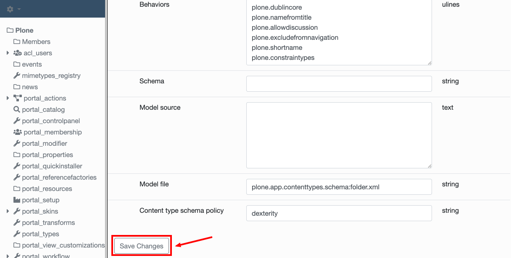

In the [Portfolio Folder](http://localhost:8080/Plone/portfolio), enable the view:
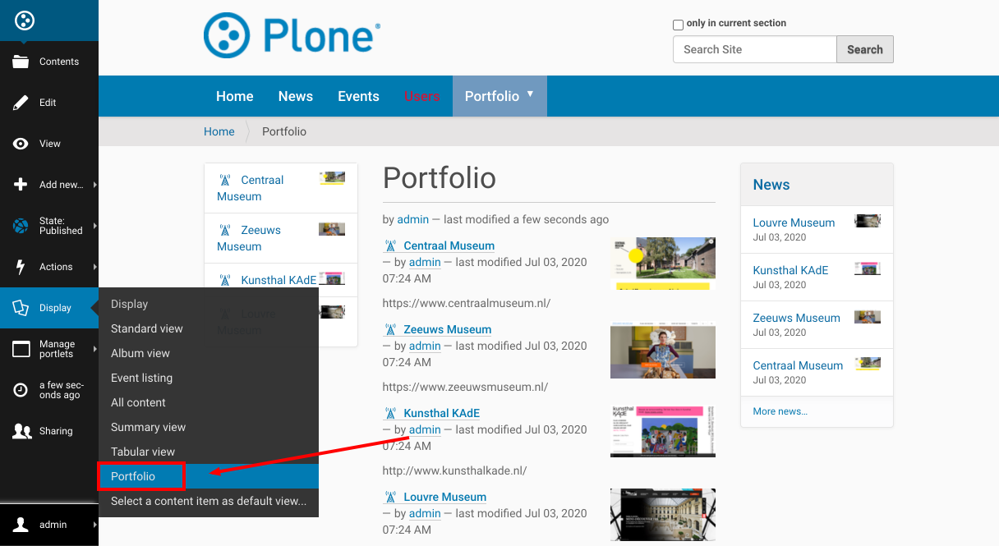

The result is something like this:
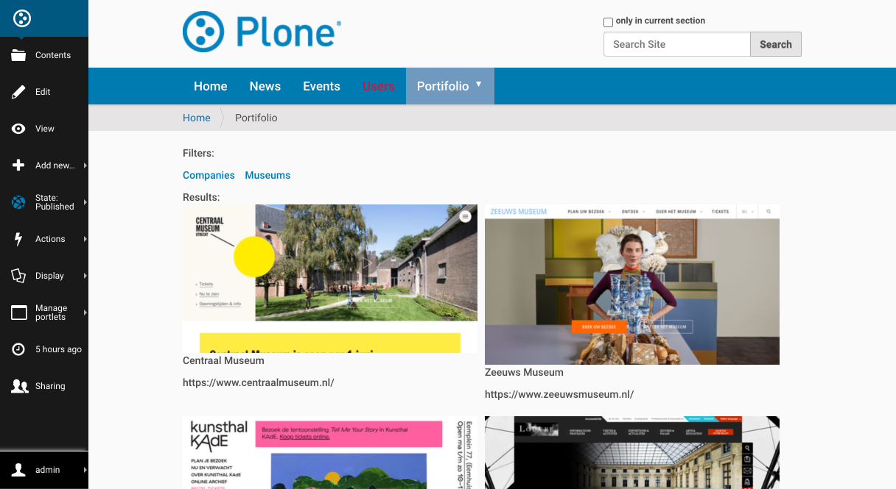
