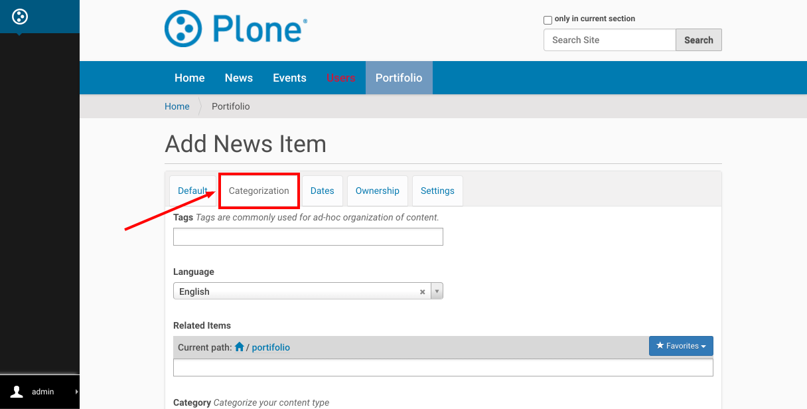
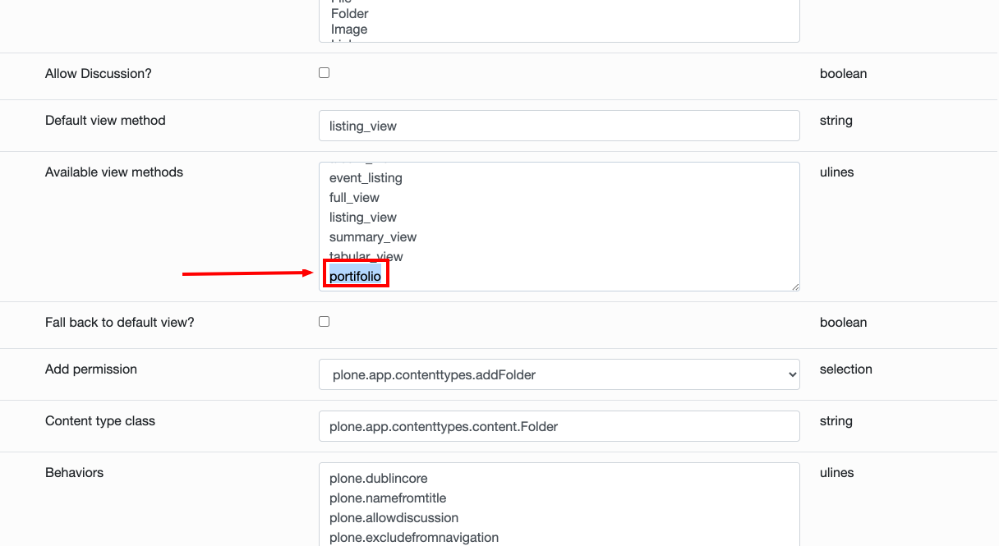

## Creating a Portifolio

Let's think we have a company website, and need to show a Portifolio.
At this Portifolio we wish to show a list of pages created by this company grouped by two levels of categories, field of the website in portifolio and country of location.
Let's take for example a company that makes websites for Museums, and others.
At the Portifolio page we wish to be able to filter by Field and location.

### Add taxonomy
To add taxonomy we go into the [control panel](http://localhost:8080/Plone/@@overview-controlpanel) and click in Taxonomies option:


This is the place where you manage your Taxonomies, let's add a new Taxonomy:


Here we have many options related to the new category, let's fill the first 3 fields:


And hit the Add button:


### Add taxonomy data
Now that we have our first Taxonomy created, let's add some data in it with the option "Edit taxonomy data":


The editor allow you to edit a tree structure, what allow us to create a complex categorization, for our simple use case we will use just 2 levels, but you can use as much as needed:


This is the final result of our categories, hit "Submit" when you have the same.


### Enable behavior
After this configuration we have a new field ready to be added to our content type, but we still need associate both.
To do this, let's go to the [Dexterity Content Types](http://localhost:8080/Plone/@@dexterity-types) configuration:


Open the content type we want to associate with our taxonomy (in this case "News Item"):


Click on the "Behaviors" tab:


Select our taxonomy:


And hit "Save" button:


### Add categorized News items
Finally it is time to create our Portifolio!

Let's add a folder in the [root](http://localhost:8080/Plone):


With name Portifolio:


Don't forget to Publish:


Than [inside this folder](http://localhost:8080/Plone/portifolio) let's add some "News items":


And our taxonomy is in the "Categorization" tab:


To add a Category, select the item and click on the "↓" button (note that you can add more than one category):


Add as many items as needed.

### Add a view to show the Portifolio
Now you can create a new view for Folder to show the Portifolio with the filters, following the [Plone documentation](https://docs.plone.org/external/plone.app.dexterity/docs/custom-views.html), we suggest to have this in your new view:

At your `browser.py` file, create the browser view:
```python
from Products.Five.browser import BrowserView


class Portifolio(BrowserView):

    """Portifolio view."""

    def _setup(self):
        self.tile_id = self.request.form.get('tile-id', None)

    def __call__(self):
        self._setup()
        return self.index()
```

Add the `portifolio.pt` template:
```html

```

And wire everything in the `configure.zcml` file:
```xml
<configure
    ...
    xmlns:browser="http://namespaces.zope.org/browser"
    ...>

  ...

  <browser:page
      name="portifolio"
      for="plone.app.contenttypes.interfaces.IFolder"
      class=".browser.Portifolio"
      template="portifolio.pt"
      permission="zope2.View"
      />
  <browser:menuItems
      for="plone.app.contenttypes.interfaces.IFolder"
      menu="plone_displayviews">
    <browser:menuItem
        title="Portifolio"
        action="portifolio"
        description="Portifolio view"
        />
  </browser:menuItems>

  ...

</configure>
```

Well, it is a little beyond this tutorial, but instead of override the default view, let's [add the new view method at ZMI](http://localhost:8080/Plone/portal_types/Folder):


### Video generated by Test
In this cypress test we do almost the same, it runs every time we have a modification in this package to make sure if everything is working:
